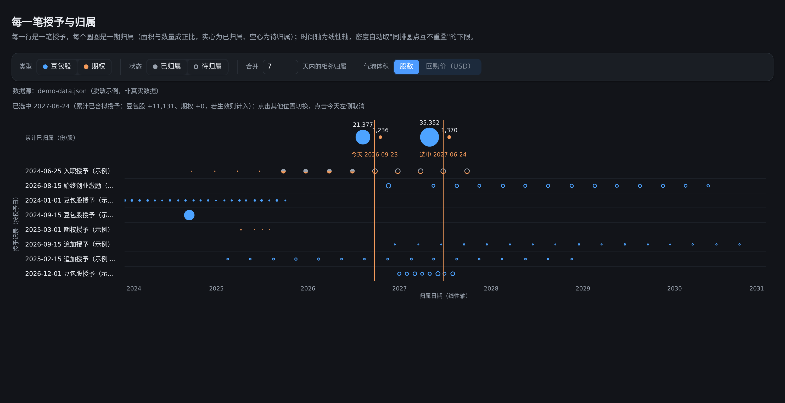

# 期权 & 豆包股归属周期可视化



> 上图是仓库自带的**合成示例数据**（`demo-data.json`）：8 笔授予、97 期归属，图上能看到
> 一次性/月度/季度三种节奏、"默认 7 天内相邻两期自动合并为一个气泡"、契约修订的灰顶分片，
> 以及"今天线 / 选中线"上的累计读数。零数据即可体验。


把授予记录（PDF）与拟授予明细（系统里复制的文本）变成一份可交互的归属时间线网页：
每一行是一笔授予，每个圆圈是一期归属（面积与数量成正比），时间轴为线性轴，
密度自动取「同排圆点互不重叠」的理论下限；支持按类型/状态筛选、合并相邻期、切换气泡体积口径（股数 / 回购价）、
点击任意日期查看该日累计归属。

## 给同事的一句话 prompt（复制发给 TA 的 agent）

> 克隆 `<仓库地址>`，按仓库根目录的 `AGENTS.md` 流程，
> 帮我把授予记录 PDF 和拟授予归属明细做成归属时间线并起本地服务。

Agent 会先读 `AGENTS.md`，然后引导 TA 提供两类材料：

1. **授予记录 PDF**（已生效的授予通知/协议，文本型 PDF，放同一目录）；
2. **拟授予逐期明细**：飞书 → **期权激励** → **授予详情** → 点开「拟授予」记录 → 详情页全选复制 → 存成文本文件。

随后 agent 会跑一条命令生成数据、起 HTTP 服务，并把 URL 交给 TA：

```bash
python3 scripts/prepare.py --pdfs ~/awards_pdf --pending ~/pending.txt --out data/awards-timeline.json
python3 -m http.server 8000        # 打开 http://localhost:8000/
```

没有任何真实数据也能先看效果：仓库自带 `demo-data.json`（由真实数据脱敏、改数、删条目后生成），
不提供数据时页面自动回退到它，并在顶部标注「脱敏示例，非真实数据」。


## 项目结构

> 仓库内**不含任何真实授予数据**。默认数据路径 `data/` 已被 `.gitignore` 忽略，
> 仓库自带的 `demo-data.json` 是完全虚构的示例（编号、日期、数量均为编造），用于演示与开发。

| 文件 | 说明 |
| --- | --- |
| `index.html` / `app.js` | 页面与全部渲染逻辑（数据完全外置） |
| `demo-data.json` | 脱敏示例数据（虚构编号、改动过的数量与日期） |
| `AGENTS.md` | 给 AI agent 的完整作业指引 |
| `scripts/prepare.py` | 一条命令跑完整管线（PDF + 拟授予文本 → 页面数据） |
| `scripts/extract_from_pdfs.py` | 解析授予记录 PDF → 结构化 awards.json + CSV |
| `scripts/parse_pending_text.py` | 解析「拟授予详情」粘贴文本 → 逐期归属 CSV |
| `scripts/build_timeline_data.py` | 合并成页面数据格式 |
| `scripts/build_standalone.py` | 打包成数据内嵌的单文件 HTML |
| `scripts/make_demo_data.py` | 把真实数据脱敏成 demo 数据 |

## 运行

```bash
cd vesting-timeline
python3 -m http.server 8000
# 打开 http://localhost:8000/
```

首次打开若没有提供自己的数据，会自动回退到 `demo-data.json`，页面顶部会提示"脱敏示例，非真实数据"。
（回退时浏览器控制台会出现一条 `data/awards-timeline.json` 的 404，属预期行为。）

## 使用自己的数据（不进仓库）

需要部署到公网时，可使用 [CloudBase 免费体验部署](docs/cloudbase-deployment.md)；
也保留 [Cloudflare 部署步骤](docs/cloudflare-deployment.md) 作为备选。
部署包与本地仓库分开构建：CloudBase 使用个人口令，Cloudflare 使用邮箱登录，保护页面及数据；不要直接公开整个仓库目录。

两种方式，都不会让真实数据进入仓库：

1. 放在被忽略的 `data/` 目录里：`vesting-timeline/data/awards-timeline.json`（`.gitignore` 已忽略 `data/`）；
2. 放在仓库之外的任意位置，用查询参数指定，例如从仓库上级目录起服务：

   ```bash
   cd ..                                  # 仓库的上一级
   python3 -m http.server 8000
   # 打开 http://localhost:8000/vesting-timeline/?data=../private/awards-timeline.json
   ```

可用查询参数：

| 参数 | 说明 |
| --- | --- |
| `?data=<路径>` | 数据文件路径（相对当前页面），默认 `data/awards-timeline.json` |
| `?today=YYYY-MM-DD` | 指定"今天"，用于区分已归属/待归属；默认取浏览器当天 |

## 数据格式

```jsonc
{
  "as_of": "2026-09-22",              // 可选：数据截止日，仅用于页面提示
  "awards": {
    "DEMO-OPT-001": {
      "label": "入职授予（示例）",        // 授予原因/类型，显示在行标签上
      "cat": "option",                 // option | dola（决定颜色）
      "units": 400,                    // 授予总量
      "grant": "2024-03-01",           // 授予日，显示在行标签上
      "exp": "2034-03-01",             // 可选：到期日，仅悬停提示
      "proposed": true,                // 可选：拟授予（未生效）
      "amended": "契约修订说明…"          // 可选：悬停提示里的一句话
    }
  },
  "order": ["DEMO-OPT-001"],           // 行顺序（缺省则用 awards 的键顺序）
  "prices": {                          // 可选：回购价（USD/单位），用于"气泡体积 = 股数 × 回购价"口径
    "option": 241.35, "dola": 17
  },
  "tranches": [
    ["2025-03-01", "DEMO-OPT-001", "option", 100, "tranche"]  // [归属日, 授予编号, 类型, 数量, kind]
  ],
  "orig_plan": {                       // 可选：受修订影响的期次——"该日原计划归属额"
    "DEMO-OPT-002|2026-09-01": 75
  }
}
```

`tranches[].kind` 取值：

| kind | 含义 |
| --- | --- |
| `tranche` | 已生效授予的正常归属期 |
| `ptranche` | 拟授予（未生效）的归属期 |
| `cancel` | 被取消的数量（不参与累计，也不显示为圆点） |

`orig_plan` 里出现的期次会画成**灰顶/原色底的分片**：上方灰色面积 = 该日原计划中不再归属的部分，
下方原色面积 = 实际存续归属的部分，比例按数量。

## 交互

- **下次归属提示卡**：显示从今天起最近的归属日期、剩余天数，以及当天所有授予合计的豆包股份数和期权股数。
  今天有归属时显示「今天归属」；合计包含的拟授予会单独注明数量与未生效状态。取消及零数量期次不计入，
  没有后续期次时显示空状态。此卡按原始逐期日期汇总，不受图表筛选、合并天数或气泡金额口径影响。
- 顶部开关：按类型（豆包股/期权）与状态（已归属/待归属）筛选；
- `合并 N 天内的相邻归属`：同一笔授予内，距该组首期不超过 N 天的各期合并为一个气泡
  （面积 = 各期之和，位置取最后一期）。N=0 表示不合并；N 越大，时间轴可压得越密。
  默认 7 天内合并（可覆盖常见的"授予日 + 次月初"这种 6 天相邻期）。
- `气泡体积`：默认按**股数**；切到**回购价（USD）**后，面积改为按 股数 × 回购价 计算，
  同时在右侧出现两个单价输入框（期权 / 豆包股），可以随时改成自己的价格：初值取自数据文件的
  `prices` 字段，缺省为期权 241.35、豆包股 17 USD。改价会立刻重算面积标度与时间轴密度；
  切回"股数"只隐藏输入框，已输入的价格会保留。
  面积标度锚点是**固定参考系**（股数口径取单期最大股数；回购价口径取默认单价下的单期最大金额）——因此改单价只会改变该类气泡的大小与时间轴密度，不会把另一类整体缩放；
  因此只改某一类单价时，只有该类气泡变大/变小，另一类尺寸不受影响；行高与表头高度会随最大半径自适应，
  单价调得很大也不会跨行重叠。
- **点击今天右侧的任意位置**（落在圆点 6px 内会吸附到该期）：会出现一条与"今天"同色的选中线，线上方两个圆给出截至该日期的累计归属
  （豆包股与期权分别计），悬停还会提示其中有多少来自拟授予；再次点击同一位置或点击今天左侧即可取消。
  在「回购价」口径下，**今天线与选中线上方的读数会切换成累计金额**（股数 × 单价，如 `$188k`），
  悬停提示里同时给出"股数 × 单价"的算式与拟授予部分对应的金额。
- 悬停：行标签显示授予编号/类型/授予日/到期日/总量/已归属；圆点显示该期数量、
  该笔累计与同类型累计归属数量；合并气泡会列出被合并的每一期。

## 从自己的数据生成

`scripts/build_timeline_data.py` 可以把结构化提取结果转成本页面的数据格式：

```bash
python3 scripts/build_timeline_data.py \
    --awards /path/to/awards.json \                 # 必填：结构化授予数据（脚本会读取其中的 grant/vesting/schedules 字段）
    --proposed /path/to/proposed_award_schedules.csv \  # 可选：拟授予的逐期归属明细
    --labels /path/to/system_award_list.csv \           # 可选：系统页面导出的中文类型标签
    --out ../private/awards-timeline.json
```

输入格式详见脚本头部注释；不同来源只需产出等价的 JSON 结构即可，渲染层与本脚本解耦。

## 已知边界

- d3 从 CDN（`cdn.jsdelivr.net`）加载；离线环境请把 `d3.min.js` 下载到本地并改 `index.html` 的引用。
- 严格"面积正比 + 线性轴 + 零重叠"三者同时满足时，整段跨度通常宽于一个屏幕，需要横向滚动；
  想一屏看完就调大合并天数 N（或缩小球尺寸，但本页面固定了面积标度）。
